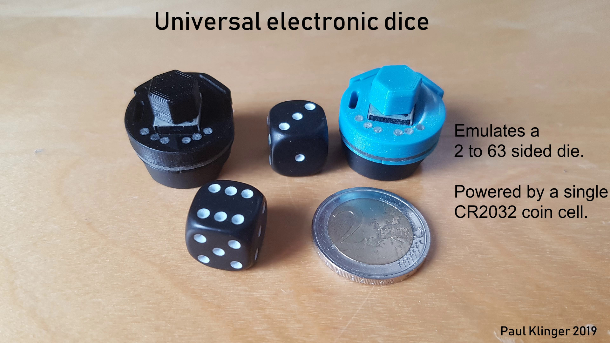

# Compact Universal Electronic Dice

Some hints for anyone trying to build these:

- The PCB should be 0.8mm thick.

- You might have noticed that the two parts of the 3D printed top part that press on the buttons are not symmetric. That's because the smd buttons have a little play on when put into the alignment holes in the PCB (I think the holes on my boards were drilled slightly oversized). I happened to solder one the left button a little further in than the right one, and designed the case around that (very professional, I know...).

- The holes over the LEDs in the top cover are filled with some 2mm PMMA fiber optic cable. I bought it [here](https://www.aliexpress.com/item/5mX-Transparent-side-glow-plastic-PMMA-fiber-optic-cable-solid-core-optic-cable-diameter-2mm-3mm/32807597828.html). This kind of fiber is not optimal for this because it glows from the side (which I needed for [this project](https://github.com/PaulKlinger/kerr_geodesic_sculpture)), but most of the light still comes out the end. Getting the fiber into the holes can be kind of tricky, depending on the precise over-/underextrusion of your 3D printer & filament (for me it was a lot easier with the blue than the black ones). I cut the tip of the fiber to a point, push it firmly through so a bit sticks out the other side, and then use pliers to pull it all the way through. Then I cut it flush using some flush cutters. The pliers and cutters invariable leave some scratches so I have to polish the top...

- To get the (3D printed) cap on the potentiometer you need to cut off the top of the knob. The ones mentioned in the BOM have a relatively soft plastic knob, so that's pretty easy. The cap should be a friction fit.

- The battery holder is soldered to the bottom, so that the MCU sits between the bottom of the battery holder and the PCB (the pins should be long enough to still reach through the PCB). Make sure that the battery holder is parallel to the PCB.

- The 3D printed spacers go between the battery holder and the PCB. I glued them to the PCB with superglue. They are mostly there to hide the gap and don't really provide mechanical support.

- The 3D printed top sort of holds in place without glue, but to make sure it sticks I superglued it to the side of the potentiometer by pressing it forward (towards the buttons) and down. This way it can still be removed by pressing in the opposite direction to break the glue.

- The oval hole on the left side of the top cover is used to reprogram the MCU without dissasembling the die. I use a small jig with three spring loaded pogo pins ([bought here](https://www.aliexpress.com/item/50pcs-set-New-P75-B1-Dia-1-02mm-100g-Cusp-Spear-Spring-Loaded-Test-Probes-Pogo/32767984398.html)) to connect to the pads underneath (you need to put some solder in the three holes to make a surface for the pins to push against). The holes are the standard pin header ones, 0.1 inch apart, so you can just solder the pogo pins into three adjacent holes of a protoboard. From the buttons down the three pads are VCC, UPDI data, GND. Here's [a picture](programming_jig.jpg) of the programming jig with a PICkit 4 connected (the PICkit doesn't provide power, so that comes from the usb). (I don't really recommend the pickit, the AVR support is still in beta and there are some irritating bugs.)